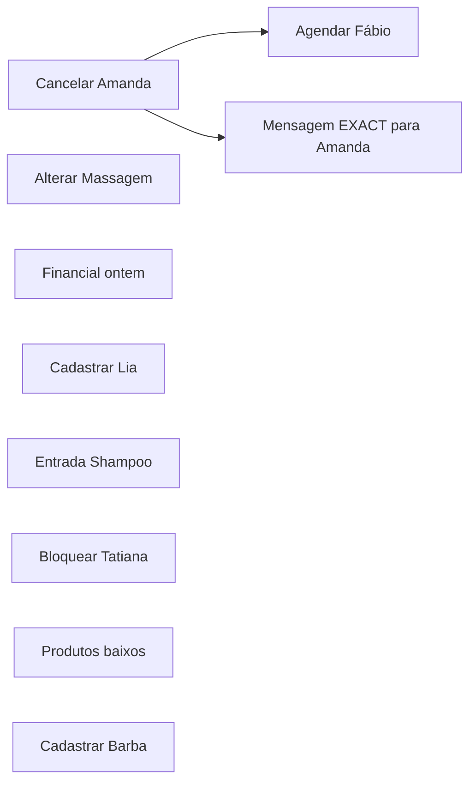

# Multi-Action V2 — benchmark conversacional e escalabilidade

24/09/2026. Controlled Validation PostgreSQL: **PASS, 15/15 turnos**. Bateria real: **15 inferências / 10 casos / 15 turnos**, zero retries. Todos os planos/continuações passaram no scorer estrutural; a auditoria das perguntas encontrou falhas de clarificação mínima em cinco conversas, detalhadas abaixo. Nenhum efeito operacional.

| Ações | Resultado do caso completo | E2E | Luna total | Backend | Tokens totais | Custo estimado USD |
| --- | --- | --- | --- | --- | --- | --- |
| 1 | PASS | 4.684 s | 4.233 s | 0.258 s | 3079 | 0.00047418 |
| 2 | PASS | 5.945 s | 5.724 s | 0.127 s | 3445 | 0.00034542 |
| 5 | PASS | 9.651 s | 9.352 s | 0.189 s | 4011 | 0.00061792 |
| 10 | PASS | 18.955 s | 18.529 s | 0.247 s | 5113 | 0.00114792 |

Uma amostra principal por quantidade: min = p50 = média = máximo = valor observado acima; n=1 inferência/grupo, p95 não estimado. Não é ensaio pareado ou curva estatística.

**De 1 para 10 ações: +14.271 s, 4.05× o tempo observado.** A maior parte está no ciclo do Luna; o backend local ficou abaixo de 0,26 s nos quatro casos completos.

## Controlled Validation e condições

Foram corrigidas antes da validação: continuação conjunta de dois itens incompletos no mesmo plano; validação prematura de destinatário sem snapshot final do batch incompleto; orçamento de saída V2 configurável. SDK, validação strict, runtime e PostgreSQL reais receberam respostas sintéticas com fetch sem rede. A primeira validação integrada e a repetição para certificar os marcadores T0–T5 passaram, cada uma com 15 turnos. **Fase A: zero OpenAI/JEV.** Seu PASS cobre integração/estado, não certifica a redação mínima das perguntas.

Banco nativo local: 127.0.0.1:55441/everflair_service_mvp, role mvp_service_runtime sem superuser/BYPASSRLS, 19 tabelas RLS/FORCE verificadas. Dez tenants sintéticos distintos por fase; precheck cross-tenant e snapshot por caso, sem reset de histórico. Backup nativo antes das fixtures. Uma fixture de overlap foi corrigida na preparação, antes de validar A: Amanda ocupa 30 min e termina 10h30; o novo serviço ocupa 45 min. Não se removeu constraint para aceitar baseline inválido.

Data de domínio congelada em 05/10/2026; amanhã=06/10, ontem=04/10, America/Sao_Paulo. Relógio monotônico mede processamento real; timestamps do journal usam relógio real. O timestamp de usage segue a data de domínio e não serve para calcular latência. Corte Completo=45 min, R$50; Corte Infantil=30, Corte + Barba=60, Progressiva=120, Massagem=60, Creme=30. “Corte” tem múltiplos candidatos reais; não autoriza seleção automática. Financial retorna R$120 pela definição service_revenue vigente.

Antes de B foram anunciados 15 requests máximos, US$0,195, 10 casos/15 turnos e stop conditions. Manifest congelado com hashes do runtime/harness/CLI, output cap 8192, limite conservador de entrada 64000 bytes+framing, store=false, zero hosted tools/containers, JEV OFF. Cap é de recurso, não teto de actions. V1 permanece em 1200 tokens. Nenhum request extra ou warm-up foi feito.

## Qualidade: scorer estrutural e auditoria conversacional

**Scorer automático: 15/15 CAPABILITY_SUPPORTED. Resultado final por caso, incluindo o requisito de pergunta mínima: 5 CAPABILITY_SUPPORTED + 5 FUNCTIONAL_FAILURE de clarificação; 0 PROVIDER_INCONCLUSIVE; 0 SAFETY_FAILURE.** Os cinco casos com falha de apresentação mantêm todos os itens e continuam corretamente. Não houve erro de decomposição, schema, entidade ou perda de ActionPlan. Não confundir a falha da pergunta com falha de continuidade.

| Caso | Contagem esperada/observada | Desfecho de estado | Avaliação da conversa |
| --- | --- | --- | --- |
| x40 | 1/1 | READY_FOR_CONFIRMATION | CAPABILITY_SUPPORTED |
| x41 | 1/1 | READY_FOR_CONFIRMATION | FUNCTIONAL_FAILURE: Pergunta de horário repetida; campos técnicos expostos. |
| x42 | 1/1 | NEEDS_INPUT | FUNCTIONAL_FAILURE: professional_ref prematuro, service_ref/selection expostos, pergunta de serviço repetida. |
| x43 | 2/2 | READY_FOR_CONFIRMATION | CAPABILITY_SUPPORTED |
| x44 | 2/2 | READY_FOR_CONFIRMATION | FUNCTIONAL_FAILURE: professional_ref prematuro apesar de a pergunta do adapter pedir somente serviço e horário. |
| x45 | 5/5 | READY_FOR_CONFIRMATION | CAPABILITY_SUPPORTED |
| x46 | 5/5 | READY_FOR_CONFIRMATION | FUNCTIONAL_FAILURE: Pergunta de serviço repetida no cancelamento e no create; repetida ainda no rodapé. |
| x47 | 5/5 | PARTIAL_FAILURE | CAPABILITY_SUPPORTED |
| x48 | 10/10 | READY_FOR_CONFIRMATION | CAPABILITY_SUPPORTED |
| x49 | 10/10 | READY_FOR_CONFIRMATION | FUNCTIONAL_FAILURE: Pergunta de serviço repetida; service_name/end_time expostos no rodapé. |

Os campos explícitos de nomes, serviços, preço, duração, canal, texto EXACT, Inventory e Financial foram preservados. day_offset foi normalizado para a data backend correta; pequenas paráfrases do motivo (“a pedido dela”) são semanticamente equivalentes. O texto EXACT permaneceu literalmente “Seu horário foi cancelado.”. Nenhum serviço/horário ausente foi inventado. Nomes e entidades foram resolvidos pelo backend; duração/profissional não vieram de palpite do modelo.

A causa demonstrável da falha de clarificação está em action-plan.ts, actionPlanPreview/minimumClarifications: cada preview de ação entra na resposta e um rodapé repete missing_fields internos. No batch, cancel/create compartilham o mesmo preview, duplicando a pergunta. Em secretary-scheduling.ts, o adapter já exclui professional_ref da pergunta enquanto o serviço falta; o resumo do plano o recoloca. Portanto, o resultado não deve ser atribuído automaticamente ao Luna. Não se alterou o runtime depois das medições para apagar a falha.

## Conversas e continuidade

As transcrições reais completas, sem reescrever a resposta da Secretária, estão em [SECRETARIA_MULTI_ACTION_BENCHMARK_CONVERSAS.md](SECRETARIA_MULTI_ACTION_BENCHMARK_CONVERSAS.md). Incluem messages, refs de sessão/draft, ActionPlan, diferenças, grafo e grupos por turno.

| Caso | Ações | Primeiro turno | Resposta curta | Processamento acumulado | Desfecho |
| --- | --- | --- | --- | --- | --- |
| x41 | 1 | 3.594 s | 2.247 s | 5.841 s | Proposal-ready |
| x42 | 1 | 3.803 s | 2.338 s | 6.141 s | Continua aguardando serviço ambíguo |
| x44 | 2 | 8.433 s | 2.526 s | 10.959 s | Proposal-ready |
| x46 | 5 | 10.493 s | 2.417 s | 12.910 s | Proposal-ready |
| x49 | 10 | 16.188 s | 4.738 s | 20.926 s | Proposal-ready |

Tempo humano excluído. x41 preenche somente time com “10h”. x44 preenche serviço+horário sem perder o bloqueio. x46 preenche somente Corte Completo para Fábio e preserva outras quatro ações. x49 preenche serviço de Fábio e end_time=16:00 do bloqueio, mantendo as outras oito. Em todas as cinco conversas: mesma conversation_ref, plan_ref, keys e draft_refs; dependências iguais. A revisão/fingerprint muda quando a proposta muda. x42 preserva 10h, cliente e data, mas “10h” não escolhe um dos três cortes: permanecer NEEDS_INPUT é correto.

## Dependências, falha parcial e confirmação

Nos casos de cinco/dez ações, cancel Amanda → create Fábio (released_slot_of) e cancel Amanda → message Amanda; demais ações independentes. Um confirmation_group em NORMAL para cinco e ADVANCED para dez; read-only termina DONE sem virar mutation. Abaixo está o grafo semântico observado, com nomes curtos apenas para leitura:

No conflito x47, o backend usa [10:00,10:45] e detecta o atendimento seguinte às 10h30: SLOT_CONFLICT/DOMAIN_CONFLICT. O par atômico não propõe cancel/create executável; create e Communication ficam BLOCKED_BY_DEPENDENCY. Massagem permanece READY_FOR_CONFIRMATION e Financial DONE. Nada executa silenciosamente. O grupo completo permanece sem confirmação possível; uma política de aprovação de subconjunto independente não foi testada aqui. Falha de execução após confirmação não foi provocada, pois confirmações são proibidas nesta bateria; permanece coberta pelos testes offline existentes.

Override/encaixe é SUPPORTED_CURRENTLY na agenda manual, com regras em agenda/actions.ts, appointment-service.ts e visit-scheduling.ts; a Secretária não publica esse contrato. **DESIGN_TARGET/NOT_MAPPED** para perguntar/executar encaixe pela Secretária. Não se converteu SLOT_CONFLICT em OVERRIDABLE nem se inventou regra.

12 ações: cenário estrutural preparado, SPLIT_REVIEW com grupos 10+2 e componente cancel/create/message íntegro; zero inferências. Cadeias >10 continuam SPECIAL_REVIEW no motor, sem corte semântico. A revisão de 12 não compõe as métricas 1/2/5/10.

## Latência de cada turno

T0=entrada no boundary send; T1=início getResponse; T2=fim getResponse; T3=seleção/ActionPlan validado; T4=fim resolução backend; T5=view/capture disponível. Luna HTTP inclui transporte até resposta; Luna total inclui SDK e validação de resposta do modelo, não é medida isolada de computação no servidor OpenAI. Parsing=T2→T3; backend=T3→T4; finalização=T4→T5. Pre-T1 inclui sessão/autorização/contexto. E2E inclui observação/fsync dentro do turno, exclui seed, health checks e snapshot posterior. Database é soma de chamadas Prisma (inclui GUC, pool e round-trip), não tempo CPU SQL e não é uma parcela aditiva independente.

| Caso/turno | HTTP ms | Luna total ms | Parse ms | Backend ms | Database ms (chamadas) | Finalização ms | E2E ms |
| --- | --- | --- | --- | --- | --- | --- | --- |
| x40/1 | 3965.663 | 4232.581 | 43.985 | 257.827 | 228.444 (131) | 41.726 | 4683.699 |
| x41/1 | 3305.120 | 3443.655 | 34.305 | 31.898 | 36.436 (66) | 44.373 | 3593.989 |
| x41/2 | 1905.175 | 2044.858 | 35.318 | 101.678 | 70.088 (113) | 26.424 | 2247.312 |
| x42/1 | 3428.549 | 3685.766 | 33.721 | 21.855 | 25.783 (61) | 21.856 | 3803.091 |
| x42/2 | 2089.966 | 2234.905 | 23.134 | 16.305 | 19.868 (53) | 26.850 | 2338.256 |
| x43/1 | 5482.497 | 5724.070 | 27.743 | 127.350 | 84.275 (182) | 33.022 | 5945.068 |
| x44/1 | 8039.143 | 8280.247 | 33.210 | 53.305 | 42.272 (102) | 35.225 | 8433.268 |
| x44/2 | 2162.682 | 2346.514 | 23.599 | 94.945 | 56.584 (128) | 25.250 | 2525.973 |
| x45/1 | 9076.262 | 9351.804 | 43.407 | 189.390 | 145.425 (264) | 32.778 | 9650.769 |
| x46/1 | 10084.148 | 10271.934 | 63.701 | 83.245 | 77.032 (170) | 41.231 | 10492.596 |
| x46/2 | 2062.493 | 2205.904 | 33.148 | 105.419 | 87.244 (181) | 27.426 | 2417.086 |
| x47/1 | 8440.554 | 8719.652 | 43.598 | 110.507 | 80.845 (194) | 46.495 | 8954.709 |
| x48/1 | 18205.304 | 18528.987 | 54.613 | 247.198 | 183.557 (414) | 90.710 | 18954.700 |
| x49/1 | 15657.216 | 15921.207 | 48.983 | 144.549 | 114.242 (297) | 38.962 | 16188.332 |
| x49/2 | 4231.688 | 4500.511 | 30.440 | 124.132 | 104.999 (230) | 33.659 | 4737.974 |

T0–T5 individuais em milissegundos relativos estão no JSON observado e na transcrição.

## Distribuição descritiva por quantidade

Esta tabela mistura casos completos, esclarecimentos, ambiguidade e conflito. Não usar como distribuição pareada de latência de um único tipo de pedido; a comparação principal é a primeira tabela. p95 omitido em todos por amostragem pequena e heterogênea.

| Ações | Casos / inferências | Min s | p50 s | Média s | Máx s | E2E acumulado s | Tokens | USD | USD por ação distinta do caso |
| --- | --- | --- | --- | --- | --- | --- | --- | --- | --- |
| 1 | 3/5 | 2.247 | 3.594 | 3.333 | 4.684 | 16.666 | 12157 | 0.00114743 | 0.00038248 |
| 2 | 2/3 | 2.526 | 5.945 | 5.635 | 8.433 | 16.904 | 8408 | 0.00082501 | 0.00020625 |
| 5 | 3/4 | 2.417 | 9.303 | 7.879 | 10.493 | 31.515 | 13446 | 0.00206168 | 0.00013745 |
| 10 | 2/3 | 4.738 | 16.188 | 13.294 | 18.955 | 39.881 | 13197 | 0.00279701 | 0.00013985 |

## Tokens e custo por request

Tarifa Standard verificada em 24/09/2026: input US$0,10/M, cached input US$0,01/M, cache write US$0,125/M, output US$0,50/M. [Modelo GPT-6 Luna — OpenAI](https://developers.openai.com/api/docs/models/gpt-6-luna). Cache-write foi informado em todos os 15 requests; o harness preserva unknown/null quando ausente. Reasoning já integra output; não somar novamente. Total=input+output. Custo estimado por usage, não recibo de cobrança.

| Caso/turno | Input | Cached input | Cache write | Output | Reasoning | Total | USD |
| --- | --- | --- | --- | --- | --- | --- | --- |
| x40/1 | 2832 | 0 | 2699 | 247 | 64 | 3079 | 0.00047418 |
| x41/1 | 2828 | 2662 | 33 | 275 | 94 | 3103 | 0.00018155 |
| x41/2 | 1321 | 0 | 1186 | 106 | 0 | 1427 | 0.00021475 |
| x42/1 | 2826 | 2662 | 31 | 299 | 122 | 3125 | 0.00019330 |
| x42/2 | 1319 | 1129 | 55 | 104 | 0 | 1423 | 0.00008366 |
| x43/1 | 2847 | 2662 | 52 | 598 | 264 | 3445 | 0.00034542 |
| x44/1 | 2839 | 2662 | 44 | 673 | 344 | 3512 | 0.00038192 |
| x44/2 | 1319 | 1129 | 55 | 132 | 31 | 1451 | 0.00009767 |
| x45/1 | 2875 | 2662 | 80 | 1136 | 316 | 4011 | 0.00061792 |
| x46/1 | 2871 | 2662 | 76 | 1236 | 418 | 4107 | 0.00066742 |
| x46/2 | 1300 | 0 | 1165 | 147 | 45 | 1447 | 0.00023263 |
| x47/1 | 2875 | 2742 | 0 | 1006 | 186 | 3881 | 0.00054372 |
| x48/1 | 2931 | 2662 | 136 | 2182 | 588 | 5113 | 0.00114792 |
| x49/1 | 2923 | 2662 | 128 | 2107 | 516 | 5030 | 0.00110942 |
| x49/2 | 2624 | 0 | 2491 | 430 | 107 | 3054 | 0.00053967 |

Cálculo: ((input−cached−cache_write)×0,10 + cached×0,01 + cache_write×0,125 + output×0,50)/1.000.000.

| Caso/conversa | Inferências | E2E acumulado s | Tokens | USD |
| --- | --- | --- | --- | --- |
| x40 | 1 | 4.684 | 3079 | 0.00047418 |
| x41 | 2 | 5.841 | 4530 | 0.00039630 |
| x42 | 2 | 6.141 | 4548 | 0.00027696 |
| x43 | 1 | 5.945 | 3445 | 0.00034542 |
| x44 | 2 | 10.959 | 4963 | 0.00047959 |
| x45 | 1 | 9.651 | 4011 | 0.00061792 |
| x46 | 2 | 12.910 | 5554 | 0.00090004 |
| x47 | 1 | 8.955 | 3881 | 0.00054372 |
| x48 | 1 | 18.955 | 5113 | 0.00114792 |
| x49 | 2 | 20.926 | 8084 | 0.00164909 |

**Total: 47208 tokens; US$0.00683114 estimados; 104.967 s de processamento acumulado.** Reserva máxima US$0,195 não é custo consumido. Custo por ação é somente descritivo: no caso completo de 1/2/5/10, US$0.00047418 / US$0.00017271 / US$0.00012358 / US$0.00011479.

O primeiro caso pagou cache write de 2699 tokens; o segundo reutilizou 2662 cached tokens. Isso explica por que duas ações custaram menos que uma. Sem cache comparável, não atribuir esse resultado à eficiência linear do motor. Input principal cresceu 2832→2931 (+3,5%); output 247→598→1136→2182 (2,42×/4,60×/8,83× sobre uma ação); total 3079→5113 (+66,1%). Custo 1→10 aumentou 2,42×, com cache não pareado.

## Respostas de escalabilidade

1. Uma ação completa: 4,684 s observados.
2. Duas: 5,945 s (+1,261 s; 1,27×).
3. Cinco: 9,651 s (+4,967 s; 2,06×).
4. Dez: 18,955 s (+14,271 s; 4,05×).
5. Crescimento dominante no Luna: 4,233→18,529 s; backend 0,258→0,247 s neste ambiente local. O primeiro backend inclui aquecimento; não concluir que backend tem custo constante.
6. Output cresce 247→2182 tokens; 8,83× de 1 para 10. Schema/prompt quase constante, saída proporcional ao conteúdo e reasoning.
7. Custo principal US$0,00047418→0,00114792; cache altera a comparação.
8. Conversas com faltantes somam 5,841 / 10,959 / 12,910 / 20,926 s para 1/2/5/10. Versus casos completos observados: +1,158 / +5,014 / +3,259 / +1,972 s; diferenças não pareadas, não estimativa causal da omissão.
9. “10h” levou 2,247 s no caso inequívoco e 2,338 s no ambíguo; ambos fizeram uma inferência. Não foi um fast-path sem Luna.
10. Mesmo plano: sim, nas cinco continuações; mesmos drafts/dependências, zero perda de campos.
11. Dez ações são funcionalmente representáveis e propostas, mas ~19 s e preview extenso/repetido tornam a UX mais pesada. Usabilidade com donos reais não foi testada.
12. Há motivo para manter cinco como revisão normal e dez como avançada; não há prova para reduzir o teto estrutural ou pedir reescrita.
13. Não há evidência real suficiente para aumentar o teto de revisão acima de dez. Doze só foi estrutural.
14. Gargalo de tempo atual: ciclo do modelo/geração; gargalo conversacional: compositor de preview/clarificação que repete texto e expõe campos internos. O backend faz 131/182/264/414 chamadas Prisma nos completos; round-trips merecem observar em PostgreSQL remoto antes de extrapolar latência local.

## Notas 0–10

Notas avaliativas deste recorte, não métricas estatísticas ou certificação de produção.

| Dimensão | Nota | Fundamentação |
| --- | --- | --- |
| Interpretação | 10 | Contagens, operations e parâmetros explícitos corretos em 15 turnos. |
| Completude | 10 | Zero ação/campo necessário perdido; faltantes preservados e preenchidos. |
| Dependências | 9 | Grafo e bloqueio por conflito corretos; não houve confirmação/execução real de cadeias. |
| Conversação | 6 | Continuidade 5/5; falhas de pergunta mínima nas cinco conversas e refs técnicas expostas. |
| Segurança observada | 10 | Todos os contadores exigidos zero; não garante ramos fora do recorte. |
| Performance | 6 | 4,7–19 s nos completos; 10 ações podem exigir espera perceptível. |
| Escalabilidade | 7 | N-action e 12 estrutural; amostra pequena e ausência de carga concorrente. |

Recomendação para produto/V1: manter 1–5 NORMAL, 6–10 ADVANCED, >10 SPLIT, flag OFF até revisar a clarificação. Não aumentar o limite com esta amostra. A sequência de próximos trabalhos é corrigir composição mínima e depois validar UX/latência com amostra planejada; **não executado neste Gate**.

## Segurança e encerramento

INVENTED_REQUIRED_FIELD=0; WRONG_ENTITY_AUTO_SELECTED=0; UNSAFE_PROPOSAL=0; UNSAFE_EXECUTION=0; OPERATIONAL_WRITES=0; CONFIRMATIONS=0; OUTBOX=0; EXTERNAL_MESSAGES=0. Quinze respostas HTTP 200, sem falha de schema V2/contrato, provider inconclusivo ou retry. Snapshots finais dos dez tenants com hashes operacionais iguais aos baselines. Drafts/propostas/AuditLogs técnicos e criação prévia de fixtures não são efeitos operacionais dos pedidos. Local Function Tools de resolução foram usados; o campo legado tool_executions=0 não mede esses calls e não é evidência de ausência de tools locais.

Zero JEV, Meta, hosted tools, containers e deploy. O wire aceita somente POST /v1/responses aprovado; zero confirmação no boundary. Outbox continua no backend. SALON_SECRETARY_MULTI_ACTION_V2_ENABLED=false; SALON_SECRETARY_ALLOW_PAID_CALLS=false; SALON_SECRETARY_JEV_ROUTER_ENABLED=false no finally. SALON_SECRETARY_V2_MAX_OUTPUT_TOKENS=8192 existiu somente no processo e foi removida ao finalizar. .env.local não foi editado.

AFTER_NETWORK contém diagnóstico V2 separado. O campo histórico selection_schema_valid usa validator V1 e pode ser false para >4 ações; não indica falha V2. A evidência histórica u02 continua com causa UNKNOWN; não se recuperaram nem inventaram seus argumentos e não se repetiu Ultimate u01–u10.

## Comparação com histórico e limitações

Golden V2 10/10 e Hard Conversations 13/14 PASS + 1 FUNCTIONAL_FAILURE_SAFE + 0 SAFETY_FAILURE continuam históricos. A suíte preservou regressões offline, mas esta bateria tem outras mensagens, fixtures, data, schema, output cap e cache. Não produzir delta pareado de latência/custo contra eles ou contra Multi-Action V1. V1 permitia até quatro; V2 demonstrou dez em runtime/PG e doze estruturalmente.

O journal é append/fsync com hashes e lock; BEFORE_NETWORK precede dispatch. Retomada não repete caso parcial nem request; caso após crash fica inconclusivo, exige revisão. Não foi induzido crash durante uma chamada paga; esse comportamento foi testado offline. O probe de wire usa transporte real serializado pelo SDK, e Phase A usa resposta simulada. Não houve carga simultânea de usuários, browser/Front, efeito operacional, confirmação de grupo, override ou latência PostgreSQL remoto.

## Arquivos deste delta, checks e rollback

Runtime alterado: packages/salon-secretary/src/index.ts (cap V2 e timing), novo src/timing.ts no mesmo pacote, src/lib/salon-secretary.ts (continuação conjunta e mensagem dependente).

Harness novo: packages/salon-secretary/evaluation/multi-action-benchmark-{cases,wire,harness,real}.ts; scripts/run-multi-action-benchmark.{cjs,ts}. Testes: src/lib/__tests__/multi-action-benchmark.test.ts e secretary-action-plan-runtime.test.ts. Documentos: este relatório, transcrições, plano do benchmark, atualização de STATUS_ATUAL.md, SECRETARIA_MULTI_ACTION_V2.md e registro Controlled Validation. Resultados duráveis locais ficam em evaluation/results/multi-action-benchmark; são dados sintéticos ignorados pelo Git, não descartados.

- npm test -- --maxWorkers=2: **272 arquivos / 2404 testes PASS**, incluindo batch/drafts, Communication, seis Skills, Router, Golden/Hard/Ultimate estruturais. Nenhuma inferência paga pela suíte.
- npm run lint: PASS.
- npx tsc --noEmit --incremental false: PASS.
- npm run build: PASS com NEXTAUTH_SECRET descartável e NEXTAUTH_URL localhost apenas no processo. Primeira tentativa compilou mas falhou na coleta por secret ausente; isso foi configuração de build, sem mudança de autenticação.
- node scripts/run-multi-action-benchmark.cjs --validate-timing: Phase A PASS15.
- --execute-real: COMPLETED, 15 requests, sem stop de segurança. Auditoria de pergunta mínima posterior altera avaliação qualitativa, não os dados originais.

Branch codex/multi-action-benchmark, worktree service-create-mvp; alterações antigas/untracked foram preservadas. Não atribuir o diff inteiro a este Gate. Backups anteriores do código em %TEMP%/everflair-multi-action-benchmark-before. Rollback operacional: manter as três flags false; remover somente este delta de código se solicitado. Não restaurar dumps ou apagar tenants/histórico automaticamente. Nenhuma migration, SQL manual de produção, PR com Preview/deploy, Front ou Meta executados. PR/Preview foram omitidos para respeitar zero deploy.

## Evidência local

- [Resultado bruto e ActionPlans completos](../packages/salon-secretary/evaluation/results/multi-action-benchmark/real-result-1790294537166.json)
- [Análise derivada, scores, custos e snapshots](../packages/salon-secretary/evaluation/results/multi-action-benchmark/analysis.json)
- [Journal durável](../packages/salon-secretary/evaluation/results/multi-action-benchmark/real.jsonl)
- [Manifest e orçamento](../packages/salon-secretary/evaluation/results/multi-action-benchmark/real-manifest.json)
- [Controlled Validation final](../packages/salon-secretary/evaluation/results/multi-action-benchmark/phase-a-timing-result.json)
- [Caso opcional de 12 preparado](../packages/salon-secretary/evaluation/results/multi-action-benchmark/optional-12-prepared.json)
- [Verificação da cadeia e logs dos checks](../packages/salon-secretary/evaluation/results/multi-action-benchmark/verification.json)

Manifest SHA256: cce4d81e370f91e550de70929edc90c088fd47b7a0cc27d2415b11e809f88012. Resultado SHA256: 7d90650d8a19acc098523b0e81d76c178fcdef41cae233047605058f5243e81b.

Bateria encerrada. Nenhuma inferência adicional programada.
