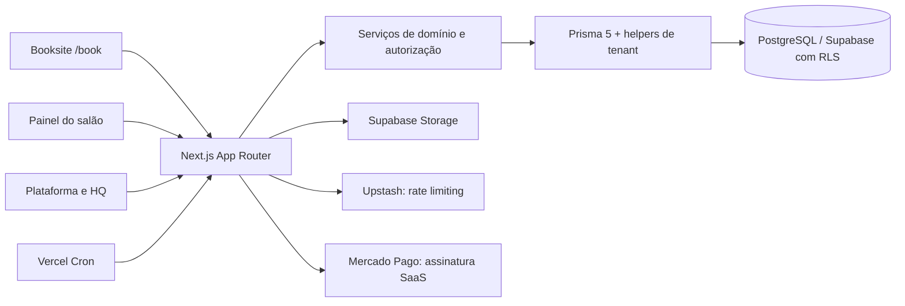

# TRD — requisitos técnicos do Everflair

**Base:** `origin/master` `27255eb` · **Leitura:** arquitetura atual e invariantes que uma alteração futura deve preservar. O status implantado é [`../STATUS_ATUAL.md`](../STATUS_ATUAL.md).

## Arquitetura e limites

| Camada | Contrato atual |
| --- | --- |
| UI | Next.js 15.5 App Router, React 18, TypeScript estrito, Tailwind/Radix; Server Components, Server Actions e rotas de API. |
| Identidade | NextAuth Credentials/JWT mantém sessão da aplicação. Contas vinculadas usam Supabase Auth após recuperação voluntária; contas legadas preservam bcrypt até a troca concluída. `AuthIdentity` não armazena senha. |
| Domínio | `src/lib` calcula disponibilidade, preço, transições, entitlements e autorização; UI não decide essas regras. |
| Dados | Prisma 5, PostgreSQL/Supabase, `salonId`, `Membership` e RLS/GUCs. Runtime `app_runtime` sem `BYPASSRLS`. |
| Integrações | Mercado Pago para assinatura do SaaS; Supabase Storage para imagens permitidas; Redis para rate limit; Resend/SMTP para recuperação; cron para lembretes e reconciliação. |
| Qualidade | Vitest, testes PostgreSQL 16 descartável, Playwright e CI `schema-smoke`. |

## Identidade, autorização e tenant

1. `User` é identidade de equipe; `ClientProfile` pertence a um salão. `AuthIdentity` vincula acessos pelo e-mail sem unir perfis, reservas ou permissões. A troca para Supabase Auth só ocorre após recuperação concluída, conforme a decisão de 20/09.
2. `Membership(userId, salonId, role)` define o acesso operacional. `PlatformRole.SUPER_ADMIN` é independente do papel no salão; o HQ possui fronteira própria. Toda ação valida sessão, papel, `salonId` e propriedade no servidor.
3. Leituras e escritas do salão devem usar `withTenant`, `withSalon`, `withUser`, `withSalonBySlug` ou `withApprovedSalon` de `src/lib/prisma-tenant.ts`, conforme o caso. GUCs e RLS são uma segunda barreira. Um slug público nunca autoriza operação em salão suspenso.
4. Nenhuma exceção operacional pode ignorar tenant, fechamento geral, autenticação ou integridade. Logs não guardam token, senha ou PII desnecessária.

## Reserva e operação transacional

- `GET /api/availability` e `GET /api/visits/availability` consultam slots. Resultado vazio legítimo é diferente de timeout, `429`, erro de rede ou contrato inválido; `Retry-After` deve ser respeitado.
- `POST /api/appointments` e `POST /api/visits` revalidam sessão, salão aprovado, serviços, profissional, recurso, estoque, regra de preço, fuso, data e horário. Nunca aceitam preço, duração ou autorização de override vindos do cliente como verdade.
- Criação/edição usa transação, lock de disponibilidade, chave de idempotência e proteção de intervalo `[startAt,endAt)` no banco. Mutações com estoque seguem ordem de locks `appointment → professional → product`, IDs ordenados. A visita com vários profissionais é atômica.
- `Appointment` mantém compatibilidade com campos principais legados; `AppointmentService` conserva itens e snapshots ordenados. O vínculo de uma visita multi-profissional está em evento `VISIT_CREATED` de `AuditLog`, não em uma nova tabela `Visit`.
- Remarcação mantém o mesmo `Appointment.id` e registra evento. A alteração imediata iniciada pela equipe ocupa o novo intervalo antes da resposta do cliente; recusa não restaura o anterior automaticamente. Solicitações legadas mantêm a regra anterior.
- Cancelamento é mudança de estado com ator/motivo/evento e liberação do slot. Status de presença/execução e recebimento não podem anteceder `startAt` no servidor.

## Dinheiro, notificações e integrações

- `Payment` é recebimento de serviços/produtos pelo salão. `BillingSubscription`, `BillingCharge`, `BillingPlanChange`, `BillingInbox` e `BillingQueue` representam cobrança do salão pela plataforma. `PlatformInvoice` é fluxo manual legado separado; a migration `011` e sua flag não devem ser confundidas com Mercado Pago live.
- Webhook Mercado Pago recebe evento, valida autenticidade, consulta o provedor e reconcilia com inbox/fila idempotentes. Retorno do navegador e autorização de cartão não ativam entitlements. Suspensão administrativa continua independente.
- `NotificationOutbox` deduplica notificações internas e retries. WhatsApp é atalho manual; não há autorização para disparo automático. Falha de aviso não desfaz reserva confirmada.
- Upload valida tipo, tamanho, propriedade e caminho por tenant. Fotos de cuidado privado não são assets públicos. Não registrar tokens de recuperação ou chaves de provedores.

## Ambientes e entrega

| Ambiente | Dados e uso permitido |
| --- | --- |
| Desenvolvimento | PostgreSQL local e dados sintéticos; scripts de schema protegidos por `src/lib/database-safety.ts`. |
| CI | PostgreSQL 16 efêmero, fixtures sintéticas, testes de RLS, concorrência e schema. |
| Preview | Sem staging inequivocamente seguro, rotas com dados ficam bloqueadas pelo guard; não herdar segredos produtivos. |
| Production | Vercel e Supabase atuais; somente deploy e operação autorizados. Nenhum seed, `db push`, teste de escrita ou migration automática. |

Mudança de schema requer migration aditiva, preflight somente leitura, identificação do projeto, backup, teste de aplicação/rollback e autorização específica antes de Production. Os dois históricos, `prisma/migrations` e `prisma/sql/manual`, são distintos; presença de um SQL não autoriza reaplicação.

## Contratos de verificação

Para qualquer alteração executável: lint, TypeScript, testes e build; para dados, também integração PostgreSQL/`schema-smoke`. Cenários obrigatórios do domínio incluem dois tenants, papéis diferentes, corrida pela mesma vaga, retry idempotente, falha no meio de visita, fuso do salão, callback de cobrança repetido e resposta fora de ordem da disponibilidade. Uma aprovação de CI/Preview não é evidência de deploy produtivo.
