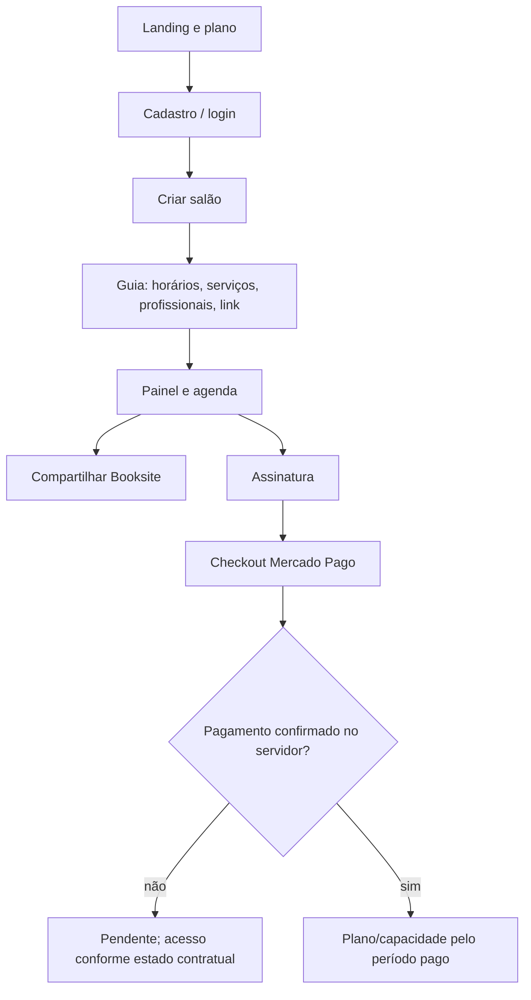
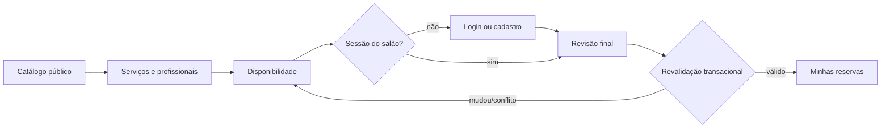

# App Flow — jornadas do Everflair

**Base:** `origin/master` `27255eb`. O fluxo descreve o caminho funcional e as decisões do servidor; telas e APIs citadas existem no repositório. Estados de revisão/deploy seguem [`../STATUS_ATUAL.md`](../STATUS_ATUAL.md).

## Mapa de entrada

| Ator | Entrada | Destino após autenticação |
| --- | --- | --- |
| Novo proprietário | Landing `/` → escolha de plano → `/signup`/`/contratar` | Criação do salão e guia `/onboarding/configuracao` |
| Equipe | `/login` ou convite `/convite/[token]` | Painel do salão permitido por `Membership` |
| Cliente | `/book/[salonSlug]` | Vitrine pública; login/cadastro antes da primeira escrita pessoal |
| Administrador global | `/login` | `/plataforma` conforme `PlatformRole` |
| Operador do HQ | `/hq` | Superfície privada, autorizada separadamente |

## 1. Proprietário: criar e operar o salão

O proprietário pode adiar e retomar o guia. Escolher um plano no frontend preserva a intenção, mas não concede entitlements. Em `/assinatura`, revisão de troca informa diferença proporcional ou vigência futura, conforme a decisão de 13/09. Cancelar renovação conserva o período já pago e não desfaz suspensão administrativa.

## 2. Cliente: descobrir e confirmar uma visita

1. Abre `/book/[salonSlug]`, vê identidade do salão, serviços, profissionais, avaliações e informações. Catálogo e disponibilidade são públicos; salão ausente ou não aprovado falha de forma uniforme.
2. Em `/book/[salonSlug]/agendar`, escolhe até dez serviços, inclusive repetidos, e o profissional de cada item. Único profissional elegível pode ser selecionado automaticamente; simultaneidade exige combinação autorizada pelo salão.
3. Escolhe data e horário para a visita inteira. O calendário público limita a antecedência a 60 dias. Slot vazio legítimo, rede/timeout e rate limit exibem mensagens diferentes; seleção anterior só é restaurada para a mesma combinação válida.
4. Antes de confirmar, entra/cria conta do mesmo salão se necessário. A volta mantém escolhas temporárias de serviços/data, sem salvar identidade pessoal em `sessionStorage` para esse fluxo.
5. Revê serviços, profissionais, data, duração, preço, endereço e política. Ao enviar, o servidor recalcula tudo; se mudou, exige nova revisão. Criação de vários atendimentos e reservas de produtos é uma transação única.
6. Sucesso leva a `/book/[salonSlug]/minhas`, com próxima visita em destaque. Dali acessa detalhes, histórico, cancelamento/remarcação dentro da política, avaliações após conclusão e notificações.

## 3. Fila e mudança proposta

- Sem vaga desejada, o cliente autenticado pode entrar na fila do horário ou na fila flexível. Oferta da fila flexível parte da gestão, respeita ordem compatível e expira em 5–60 minutos; aceite confirma uma reserva, recusa/expiração libera a vaga.
- Cancelamento pelo cliente pode promover o primeiro item elegível da fila vinculada. Cancelamento pela equipe mantém a fila ativa e exige promoção explícita de dono/gerente após nova checagem.
- Edição imediata da equipe reserva o destino e libera a origem no momento de salvar; o cliente recebe pedido de resposta. Aceite registra concordância sem mover de novo. Recusa sinaliza a reserva e notifica a equipe, mantendo destino ocupado até solução explícita. Propostas antigas preservam sua semântica de mover apenas no aceite.

## 4. Equipe: operar atendimento e recebimento

| Passo | Tela/ação | Regra de transição |
| --- | --- | --- |
| Preparar | `/agenda`, `/servicos`, `/profissionais`, `/configuracoes` | Jornada, pausas, aberturas extras, bloqueios e recursos compõem disponibilidade. |
| Registrar | Agenda → novo agendamento/visita, inclusive profissional por item | Papel, cliente, salão, preço, recursos e conflitos validados no servidor. Overrides mostram motivo e confirmação separados. |
| Executar | Agenda ou `/hoje` → chegada, início, conclusão/no-show | `IN_PROGRESS` e `COMPLETED` somente após início contratado; histórico registra ator e mudança. |
| Receber | `/financeiro` → pendência do atendimento → método/ajustes → confirmar | `Payment` só nasce na confirmação. Desmarcar mantém pendência. Receber atendimento não concluído pede confirmação de realização. |
| Relacionar | `/clientes`, `/avaliacoes`, `/marketing`, `/notificacoes` | Acesso por papel/tenant; WhatsApp é contato manual. |

Profissional pode atuar nas próprias reservas e folgas dentro da autonomia aprovada, mas não cria sobreposição deliberada entre reservas. Dono/gerente podem fazer encaixe autorizado com motivo. Recepção não acessa relatórios financeiros amplos.

## 5. Falhas e saídas

| Situação | Comportamento esperado |
| --- | --- |
| `429` na disponibilidade | Mostrar espera conforme `Retry-After`, manter escolhas e consultar novamente a combinação atual. |
| Preço, duração ou slot mudou | Bloquear confirmação e voltar à revisão com novos termos. |
| Envio repetido | Retornar resultado idempotente; não criar segunda reserva/visita. |
| Falha em pagamento SaaS | Não ativar plano por retorno do checkout; reconciliar por webhook/consulta ao provedor. |
| Sessão/tenant/papel inválido | Negar no servidor sem revelar dados de outro salão. |
| Falha de notificação | Manter operação principal confirmada e permitir retry da outbox. |
