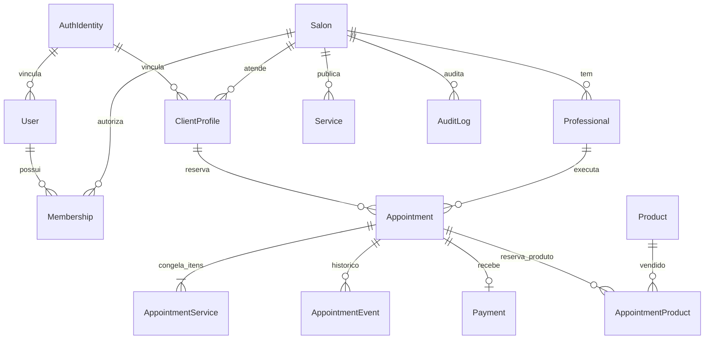
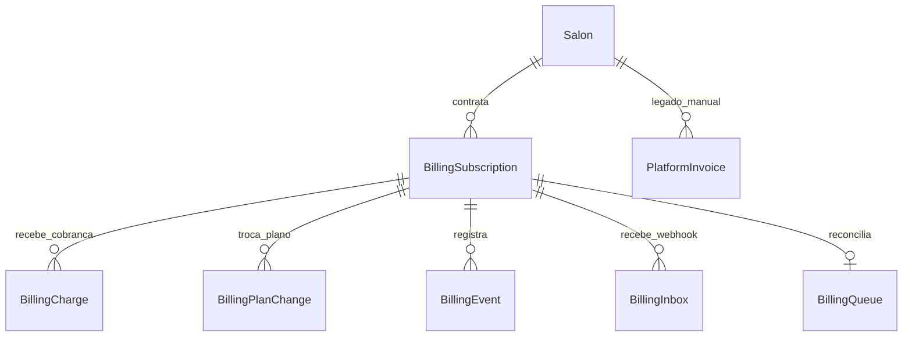

# Esquema de backend — visão conceitual

**Base:** `prisma/schema.prisma` em `origin/master` `27255eb`. Este documento seleciona as entidades que explicam o produto; não é DDL, inventário completo de colunas, migration nem evidência do schema de Production. Para mudança de banco, comparar Prisma, `prisma/migrations`, `prisma/sql/manual` e objetos/RLS reais com preflight somente leitura.

## Núcleo de identidade e operação

| Entidade | Chaves/dados essenciais | Regra de integridade |
| --- | --- | --- |
| `AuthIdentity` | UUID, e-mail único opcional, versão de sessão | Une autenticação voluntariamente, sem guardar senha ou unir autorização. |
| `User` / `Membership` | usuário global; vínculo único `(userId,salonId)` e `Role` | Papel é do vínculo, não do e-mail; `PlatformRole` é separado. |
| `Salon` | `id`, `slug` único, fuso, moeda, plano/acesso, regras de reserva | É o tenant de quase todo o domínio operacional. |
| `ClientProfile` | `(id,salonId)`, `userId?`, `authIdentityId?`, contato e mesclagem | Mesmo e-mail pode ter perfil por salão. Mesclagem não move histórico entre tenants. |
| `Professional` / `Service` | `(id,salonId)`; catálogo, vínculo `ProfessionalService` | Compatibilidade e atividade são verificadas ao reservar. |
| `WorkingHours`, `ProfessionalOpening`, `TimeOff`, `SalonClosure` | jornada semanal, abertura pontual, ausência pessoal, fechamento geral | Combinam-se no motor de disponibilidade; fechamento geral é barreira distinta. |
| `Appointment` | `salonId`, cliente, profissional/serviço principais, `[startAt,endAt)`, preço, status, versão, idempotência | Campos principais preservam compatibilidade; FKs tenant-aware ligam cliente, profissional e serviço do mesmo salão. |
| `AppointmentService` | `(appointmentId,position)`, `salonId`, serviço, nome/duração/preço congelados | Itens ordenados; alterações no catálogo não reescrevem contrato antigo. |
| `AppointmentEvent` / `AuditLog` | ator, tipo, antes/depois, motivo, correlação, instante | Histórico append-only de transições e exceções. `VISIT_CREATED` em `AuditLog` vincula atendimentos de uma visita multi-profissional. |
| `Payment` | `appointmentId` único, valor, método, data, ajuste | Recebimento do cliente; pertence ao salão pela reserva, separado de billing SaaS. |

Uma visita com profissionais distintos persiste como **vários `Appointment`** numa transação. Itens contínuos de um profissional ficam em `AppointmentService`; o vínculo da visita é o evento `VISIT_CREATED`. Não existe tabela `Visit` neste schema. Uma visita não deve ser reconstruída como autorização de acesso: cada reserva continua exigindo checagem de tenant/papel.

## Domínios complementares

| Domínio | Entidades principais | Observação |
| --- | --- | --- |
| Fila | `WaitlistEntry`, `FlexibleWaitlist`, `FlexibleWaitlistService`, `WaitlistOffer` | Fila vinculada a horário e oferta flexível são fluxos distintos; expiração/aceite precisam ser idempotentes. |
| Produtos/recursos | `Product`, `AppointmentProduct`, `PhysicalResource`, `ResourceBooking` | Reserva e baixa devem ser transacionais; chaves compostas com `salonId` impedem relação cruzada. |
| Relacionamento | `ClientReview`, `NotificationOutbox`, `ClientDependent`, `CareEntry`, `PortfolioItem` | Avaliação só após conclusão; cuidado/foto privado exige controle de acesso, não bucket público. |
| Regras comerciais | `ServicePricingRule`, `Package`, `PackagePurchase`, `MembershipPlan`, `ClientSubscription`, `Expense` | Preço vigente é calculado no servidor; valor contratado fica em snapshot. |
| Propostas | `RescheduleProposal` | Guarda termos congelados, versão e resposta; semântica imediata e legada coexistem. |

## Cobrança da plataforma e HQ

`BillingSubscription` preserva plano, capacidade, ciclo, provedor e `paidThrough`; `BillingCharge` registra período, pagamento e estorno; `BillingPlanChange` registra cotação, aceite e efetivação; `BillingInbox`/`BillingQueue` suportam deduplicação e retry. Os IDs e índices únicos de provedor/chave de solicitação impedem duplicação. `PlatformInvoice` e `PlatformInvoiceEvent` são a cobrança manual legada da plataforma, distinta do Mercado Pago e de `Payment`. HQ usa tabelas `Hq*` próprias, com acesso e auditoria separados; não reutilizar autorização de salão para dados globais.

## Invariantes físicos e retenção

- Índices e FKs compostas `(id,salonId)` existem em relações críticas. RLS e GUCs restringem o runtime `app_runtime` sem `BYPASSRLS`; a checagem no código continua necessária.
- Instantes de reserva e evento são `timestamptz`; fuso IANA do salão converte data civil na borda. Não armazenar horário local como se fosse instante UTC.
- `AppointmentStatus` do schema é `PENDING`, `CONFIRMED`, `IN_PROGRESS`, `COMPLETED`, `CANCELLED`, `NO_SHOW`. Chegada é `checkedInAt`, e origem/ator de cancelamento ficam em metadados/eventos; não criar enum futuro por dedução deste documento.
- Não excluir histórico para representar cancelamento, suspensão, estorno, ocultação de cliente ou recusa de alteração. Uma mudança destrutiva exige desenho específico de retenção, migração e recuperação.
